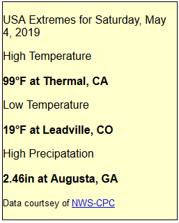
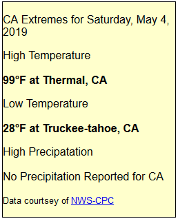

# NWS Climate Prediction Center - USA Extremes

This script was originated by Michael of Relayweather.com and has been rewritten to use the [NWS Climate Prediction Center's](https://www.cpc.noaa.gov/products/analysis_monitoring/cdus/prcp_temp_tables/) One Day Old Daily Data Summary text file for the USA.
The script does not produce output (other than HTML comments for status), so you are free to include it in a page, and format the text output as you desire. The script returns data in four variables:

**_$usahigh_** - contains the text of the high temperature station(s) (value and station name from the NWS)  
_**$usalow**_ - contains the text of the low temperature station(s) (value and station name from the NWS)  
_**$usaprecip**_ - contains the text of the high precipitation station(s) (value and station name from the NWS)  
_**$reportDate**_ - contains the text of the date for the report (default format is 'Dayname, Month day, Year')

You can run the script by using:

```php
<?php
include_once("usaextremes.php");

print "<p>USA Extremes for $reportDate</p>\n";
print "<p>High Temperature<br/><br/>$usahigh</p>\n";
print "<p>Low Temperature<br/><br/>$usalow</p>\n";
print "<p>High Precipatation<br/><br/>$usaprecip</p>\n";
print "<p><small>Data courtsey of <a href=\"";
print "https://www.cpc.noaa.gov/products/analysis_monitoring/cdus/prcp_temp_tables/";
print "\">NWS-CPC</a></small></p>\n";

?>
```

which produces this result :




The script has internal settings which you can adjust. If run in a Saratoga template, the cache file will be stored in the ./cache/ directory based on $SITE['cacheFileDir'] in Settings.php.

```php
// Site to Parse
$url2 = "https://www.cpc.ncep.noaa.gov/products/analysis_monitoring/cdus/prcp_temp_tables/dly_glob1.txt";
// Name of cache file  --  This file must be set to CHMOD-666
$cacheFileDir = './'; // directory to store cache file in.
$cacheFile2 = "usaextremesCache4.txt";  
// Age of cache file before re-fetch caching time, in seconds (3600 = 1 hour)
$cache_life = '3600';
$reportDateFormat = "l, F j, Y"; // Day, Month d, yyyy
$tUOM = '&deg;F'; // or ='' for no temperature unit display
$rUOM = 'in';     // or ='' for no rain unit display
$ignoreStations = array('99NRB'); // Station numbers to ignore, Array of station numbers
```

A companion script _stateextremes.php_ is also in this distribution.  

it adds one setting:

```php
$selectState = 'CA'; // state to select
```

It will return data for that state in the variables:

**_$statehigh_** - contains the text of the high temperature station(s) (value and station name from the NWS)  
**_$statelow_** - contains the text of the low temperature station(s) (value and station name from the NWS)  
**_$stateprecip_** - contains the text of the high precipitation station(s) (value and station name from the NWS)  

which can be printed by

```php
<?php
include_once("stateextremes.php");

print "<p>$selectState Extremes for $reportDate</p>\n";
print "<p>High Temperature<br/><br/>$statehigh</p>\n";
print "<p>Low Temperature<br/><br/>$statelow</p>\n";
print "<p>High Precipatation<br/><br/>$stateprecip</p>\n";
print "<p><small>Data courtsey of <a href=\"";
print "https://www.cpc.noaa.gov/products/analysis_monitoring/cdus/prcp_temp_tables/";
print "\">NWS-CPC</a></small></p>\n";

?>
```
with a result like:



Note that the scripts use the same cache file name, so whichever runs first will load the cache if needed, and the second script will simply use the cached data.  The cache is refreshed once per hour (default)
